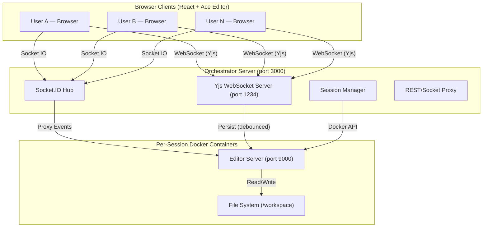
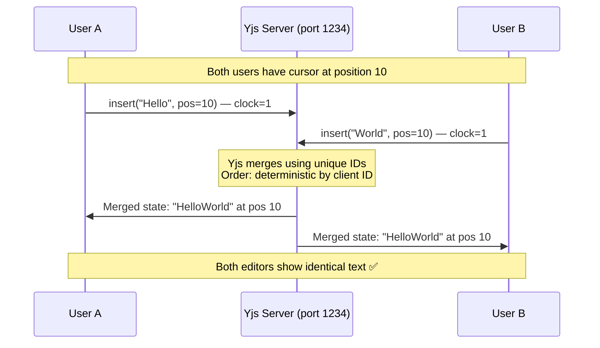
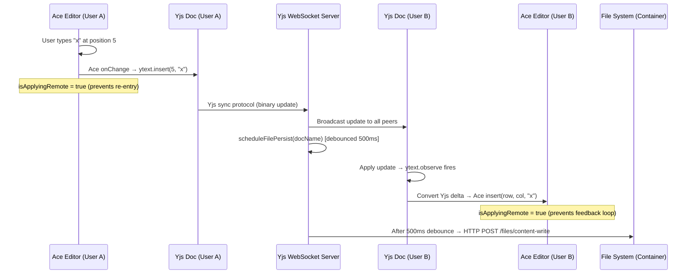
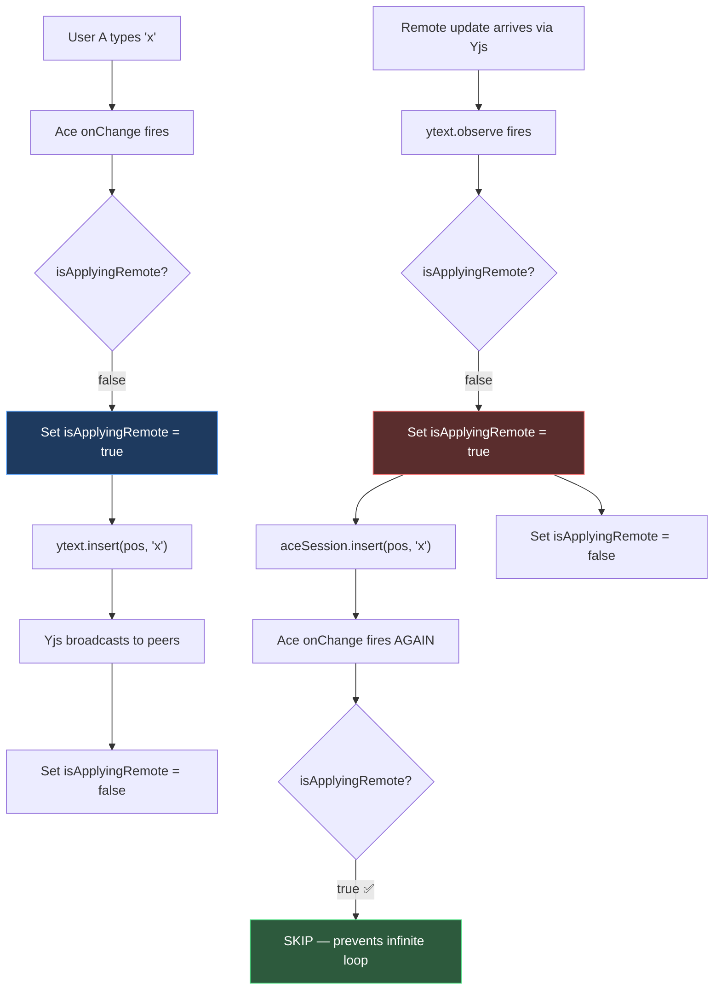
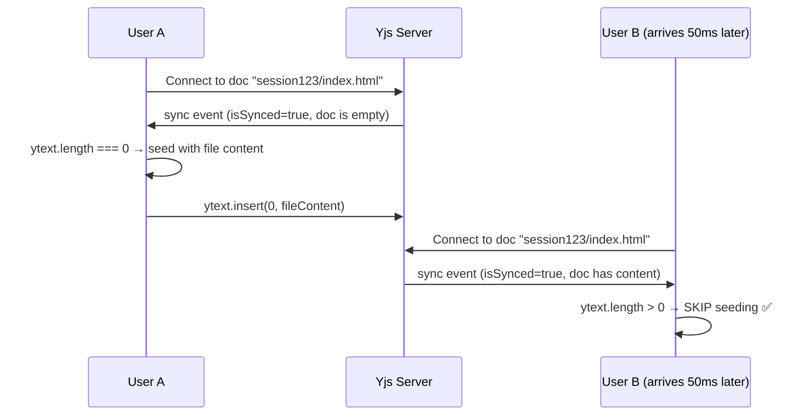
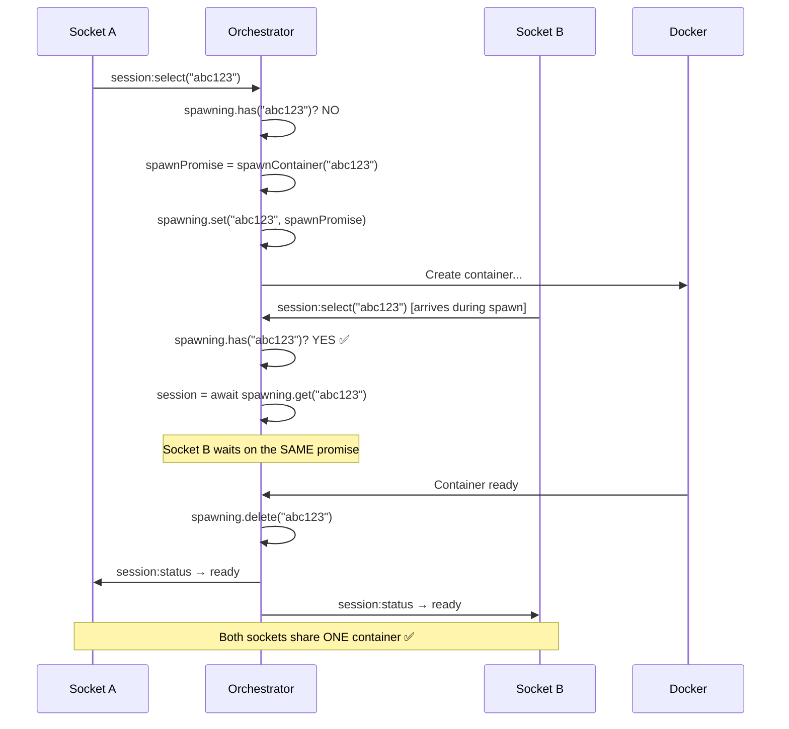
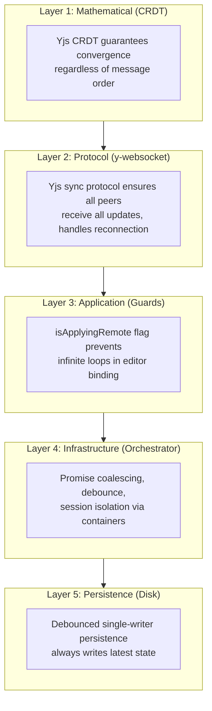
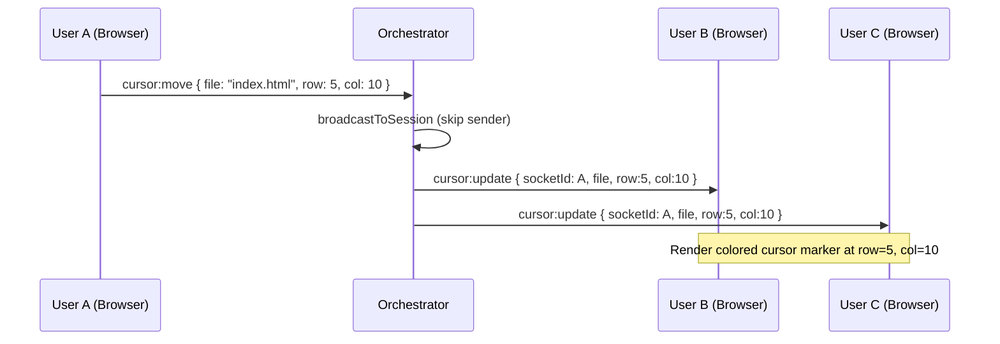
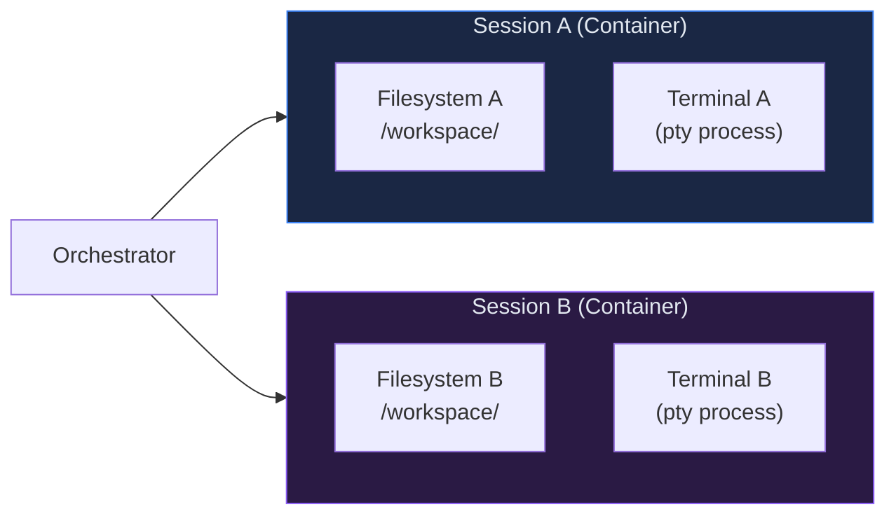
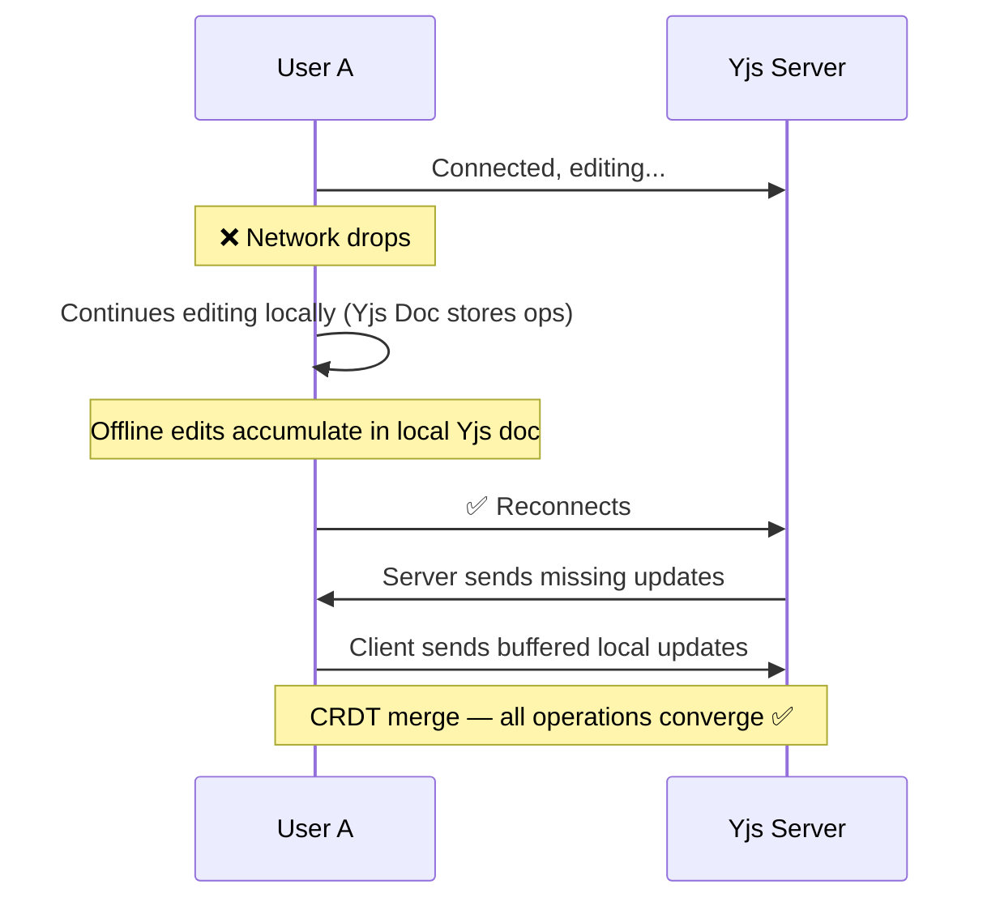

# Concurrency in Multi-User Document Collaboration — Coder Buddy

## 1. Overview

Coder Buddy is a collaborative, cloud-based IDE where **multiple users can open and edit the same document simultaneously** within a shared session. Maintaining consistency—ensuring no edits are lost, no data is corrupted, and all users see the same final state—requires a carefully designed concurrency model.

This document provides a deep-dive into **how concurrency is maintained**, **how race conditions are prevented**, and **how critical sections are handled** across every layer of the system.

---

## 2. System Architecture (Concurrency Perspective)



### Key Components Involved in Concurrency

| Component | Role in Concurrency |
|---|---|
| **Yjs (CRDT Library)** | Conflict-free merging of simultaneous edits |
| **y-websocket** | Syncs Yjs document state between all connected peers in real-time |
| **Orchestrator** | Central hub — routes sockets, manages sessions, runs Yjs server |
| **Socket.IO** | Broadcasts cursor positions, file changes, and system events |
| **Editor Server** | Per-session container handling file I/O — the "source of truth" on disk |
| **Ace Editor** | Client-side editor bound to Yjs — bidirectional data binding |

---

## 3. The CRDT Foundation — How Yjs Eliminates Conflicts

### 3.1 What is a CRDT?

A **CRDT (Conflict-free Replicated Data Type)** is a data structure that can be independently modified on multiple replicas and **always converges to the same state** without requiring a central coordinator or locks.

Yjs implements a **sequence CRDT** specifically designed for collaborative text editing. Each character in the document has:

- A **unique ID** (client ID + clock counter)
- A **position** relative to its left and right neighbors
- **Tombstone markers** for deleted characters

> [!IMPORTANT]
> CRDTs are the core reason this system can support concurrent edits without locks or mutexes. Unlike traditional approaches (OT, locking), CRDTs guarantee convergence **mathematically**, regardless of network ordering or timing.

### 3.2 How It Works in the Codebase

**File:** [useYjsDoc.js](file:///d:/coder-assist-main/coder-assist-main/editor/client/src/hooks/useYjsDoc.js)

```javascript
// Each file in each session gets a unique Yjs document
const docName = `${sessionId}/${filePath.replace(/^\//, '')}`;

const doc = new Y.Doc();
const ytext = doc.getText('content');

// Connect to the central Yjs WebSocket server
const provider = new WebsocketProvider(YJS_URL, docName, doc);
```

**What happens when two users type at the same position simultaneously:**



### 3.3 The Convergence Guarantee

| Scenario | Traditional Approach | Yjs CRDT Approach |
|---|---|---|
| Two users insert at the same position | **Race condition** — one overwrite wins | Both insertions preserved; ordered deterministically by client ID |
| User A deletes text while User B edits it | **Conflict** — requires manual resolution | Deletion is a tombstone; B's edit applies to remaining text |
| Network partition — users edit offline | **Data loss** when reconnecting | All operations merge cleanly on reconnect |
| Messages arrive out of order | **Corrupted state** | CRDTs are **commutative** and **idempotent** — order doesn't matter |

---

## 4. Real-Time Synchronization Pipeline

### 4.1 End-to-End Flow: User A Types → User B Sees It



### 4.2 The Bidirectional Binding (Critical Section #1)

**File:** [App.jsx — Lines 112-179](file:///d:/coder-assist-main/coder-assist-main/editor/client/src/App.jsx#L112-L179)

This is the most critical piece of concurrency logic in the client:

```javascript
let isApplyingRemote = false;

// Yjs → Ace: apply remote changes
const onYjsUpdate = (event) => {
    if (isApplyingRemote) return;    // ← CRITICAL: prevent infinite loop
    isApplyingRemote = true;
    try {
        event.changes.forEach(change => {
            if (change.retain) { index += change.retain; }
            else if (change.insert) {
                const pos = doc.indexToPosition(index, 0);
                aceSession.insert(pos, change.insert);
            }
            else if (change.delete) {
                const start = doc.indexToPosition(index, 0);
                const end = doc.indexToPosition(index + change.delete, 0);
                aceSession.remove({ start, end });
            }
        });
    } catch { /* fallback: full reset */ }
    isApplyingRemote = false;
};

// Ace → Yjs: convert local edit to CRDT op
const onAceChange = (delta) => {
    if (isApplyingRemote) return;    // ← CRITICAL: prevent feedback loop
    isApplyingRemote = true;
    try {
        const start = doc.positionToIndex(delta.start, 0);
        if (delta.action === 'insert') {
            ytext.insert(start, delta.lines.join('\n'));
        } else if (delta.action === 'remove') {
            ytext.delete(start, delta.lines.join('\n').length);
        }
    } catch (e) { console.warn('[Yjs] delta error:', e.message); }
    isApplyingRemote = false;
};
```

> [!CAUTION]
> **The `isApplyingRemote` flag is the most important critical section guard in the entire system.**
> Without it, a change from Yjs would trigger an Ace `onChange`, which would write back to Yjs, which would trigger another Ace change — creating an **infinite feedback loop** that crashes the browser.

#### How the Guard Works:



---

## 5. Race Conditions — Identified and Mitigated

### 5.1 Race Condition: Document Initialization

**Problem:** When the first user opens a file, the Yjs document is empty and needs to be seeded with the file content from disk. But what if two users open the same file at nearly the same time?

**File:** [useYjsDoc.js — Lines 40-49](file:///d:/coder-assist-main/coder-assist-main/editor/client/src/hooks/useYjsDoc.js#L40-L49)

```javascript
provider.on('sync', (isSynced) => {
    if (isSynced) {
        // RACE GUARD: Only seed if the document is still empty
        if (ytext.length === 0 && initialContent) {
            doc.transact(() => {
                ytext.insert(0, initialContent);
            });
        }
        setSynced(true);
    }
});
```

**Mitigation Strategy:**

| Check | What it prevents |
|---|---|
| `ytext.length === 0` | If another user already seeded the doc, we skip seeding — prevents **duplicate content** |
| `doc.transact(() => {...})` | Groups the insert into a single atomic Yjs transaction — prevents **partial states** visible to other peers |
| `provider.on('sync')` | Waits until the Yjs server confirms sync — ensures we see the **latest state** before deciding to seed |



### 5.2 Race Condition: Container Spawning

**Problem:** If two browser tabs for the same session try to spawn a container simultaneously, you'd get duplicate containers.

**File:** [orchestrator/index.js — Lines 62-67, 296-311](file:///d:/coder-assist-main/coder-assist-main/orchestrator/index.js#L62-L67)

```javascript
// Track in-progress spawns to prevent duplicate containers
const spawning = new Map();

async function attachSession(socket, sessionId, forceNew) {
    let session = sessions.get(sessionId);

    if (!session || forceNew) {
        if (spawning.has(sessionId)) {
            // ANOTHER socket is already spawning this session — WAIT for it
            session = await spawning.get(sessionId);
        } else {
            // First request: start spawning, store the promise
            const spawnPromise = spawnContainer(sessionId);
            spawning.set(sessionId, spawnPromise);
            session = await spawnPromise;
            spawning.delete(sessionId);
            sessions.set(sessionId, session);
        }
    }
}
```

**Mitigation: Promise Coalescing Pattern**



> [!NOTE]
> This is a classic **"promise coalescing"** or **"request deduplication"** pattern. The key insight is that JavaScript Promises can be shared: multiple callers can `await` the same promise, and they'll all receive the result when it resolves.

### 5.3 Race Condition: File Persistence from Yjs

**Problem:** Every keystroke triggers a Yjs `update` event. If each update immediately wrote to disk, you'd get:
- Excessive I/O thrashing
- Potential write-write conflicts (two writes overlapping for the same file)
- Performance degradation

**File:** [orchestrator/index.js — Lines 38-61](file:///d:/coder-assist-main/coder-assist-main/orchestrator/index.js#L38-L61)

```javascript
const persistDebounces = new Map();

async function scheduleFilePersist(docName) {
    // CANCEL any pending write for this document
    if (persistDebounces.has(docName)) {
        clearTimeout(persistDebounces.get(docName));
    }

    // SCHEDULE a new write 500ms in the future
    persistDebounces.set(docName, setTimeout(async () => {
        persistDebounces.delete(docName);
        const doc = docs.get(docName);
        if (!doc) return;

        const [sessionId, ...fileParts] = docName.split('/');
        const filePath = fileParts.join('/');
        const session = sessions.get(sessionId);
        if (!session) return;

        const ytext = doc.getText('content');
        const content = ytext.toString();

        // Single HTTP call to persist the final state
        await fetch(`http://${session.host}:9000/files/content-write`, {
            method: 'POST',
            headers: { 'Content-Type': 'application/json' },
            body: JSON.stringify({ path: filePath, content }),
        });
    }, 500));
}
```

**Why 500ms debounce works:**

```
User types: H → e → l → l → o

Time:  0ms   50ms  100ms  150ms  200ms  ...  700ms
Event:  H      e      l      l      o         ⬇️
Timer: [500ms] [reset] [reset] [reset] [reset] [FIRE]
                                                  ↓
                                            Write "Hello" to disk (one I/O)
```

> [!TIP]
> The debounce ensures **at most one write per 500ms per file**, regardless of how fast users type. The write always contains the **latest** content because it reads from the Yjs document at write time, not from the event that triggered it.

### 5.4 Race Condition: Stale Container Cleanup

**Problem:** When a user disconnects, should the container be destroyed? What if they reconnect within seconds?

**File:** [orchestrator/index.js — Lines 380-399](file:///d:/coder-assist-main/coder-assist-main/orchestrator/index.js#L380-L399)

```javascript
socket.on('disconnect', async () => {
    upstream.disconnect();
    broadcastToSession('cursor:leave', { socketId: socket.id });

    // Remove from session group
    const peers = sessionSockets.get(sessionId);
    if (peers) {
        peers.delete(socket.id);
        if (peers.size === 0) sessionSockets.delete(sessionId);
    }

    // GRACE PERIOD: wait 5 seconds before checking if session is truly empty
    setTimeout(async () => {
        const remaining = [...io.sockets.sockets.values()].filter(
            s => s.data.sessionId === sessionId
        );
        if (remaining.length === 0) {
            await destroySession(sessionId);
        }
    }, 5000);
});
```

**Mitigation: 5-Second Grace Period**

- On disconnect, the orchestrator waits **5 seconds** before checking if any sockets remain
- If a user refreshes the page, they'll reconnect within 5 seconds, so the container survives
- If truly no one is connected, the container is destroyed, freeing resources

---

## 6. Critical Sections — Detailed Analysis

### 6.1 Definition

A **critical section** is a region of code where shared mutable state is accessed, and concurrent execution could lead to inconsistent data. In this project, critical sections are protected through various mechanisms.

### 6.2 Summary of All Critical Sections

| # | Location | Shared State | Guard Mechanism | What It Prevents |
|---|---|---|---|---|
| 1 | Ace ↔ Yjs binding | Editor content + Yjs text | `isApplyingRemote` boolean flag | Infinite feedback loop between Ace and Yjs |
| 2 | Document seeding | Yjs document content | `ytext.length === 0` check + `doc.transact()` | Duplicate content insertion |
| 3 | Container spawning | `sessions` Map, `spawning` Map | Promise coalescing | Duplicate Docker containers |
| 4 | File persistence | Disk file content | Debounce timer (`persistDebounces` Map) | I/O thrashing, write-write conflicts |
| 5 | Session tracking | `sessionSockets` Map | Set-based add/delete + timeout grace period | Premature container destruction |
| 6 | Cursor broadcasting | Cursor position state | Socket ID filtering (`peerId !== socket.id`) | Cursor echo back to sender |
| 7 | Generated file writes | `writtenFiles` Set | Set membership check | Duplicate file writes during AI generation |

### 6.3 Critical Section #1: The `isApplyingRemote` Guard (Deep Dive)

This is a **reentrant guard** pattern — a single boolean that prevents a function from re-entering itself through an indirect call chain:

```
┌─────────────────────────────────────────────────┐
│              CRITICAL SECTION                    │
│                                                  │
│  isApplyingRemote = true                         │
│  ┌─────────────────────────────────────────┐     │
│  │  Modify Ace Editor content              │     │
│  │     ↓                                   │     │
│  │  Ace fires onChange                     │     │
│  │     ↓                                   │     │
│  │  onAceChange checks isApplyingRemote    │     │
│  │     ↓                                   │     │
│  │  isApplyingRemote === true → EXIT ✅    │     │
│  └─────────────────────────────────────────┘     │
│  isApplyingRemote = false                        │
│                                                  │
└─────────────────────────────────────────────────┘
```

> [!WARNING]
> This pattern works because **JavaScript is single-threaded**. In a multi-threaded environment, this boolean flag would itself be a race condition. In the browser's event loop, only one event handler runs at a time, making this safe.

### 6.4 Critical Section #2: Yjs Transactions

```javascript
doc.transact(() => {
    ytext.insert(0, initialContent);
});
```

A `doc.transact()` call:
1. **Batches** all operations inside the callback into a single update
2. Ensures peers see the operations **atomically** — they either get all of them or none
3. Generates a **single `update` event** instead of one per operation
4. Prevents other `observe` callbacks from firing until the transaction completes

This is equivalent to a **transaction** in a database — it provides **atomicity** and **isolation**.

### 6.5 Critical Section #3: Socket Session Routing

**File:** [orchestrator/index.js — Lines 337-350](file:///d:/coder-assist-main/coder-assist-main/orchestrator/index.js#L337-L350)

```javascript
// Track all sockets sharing this session
if (!sessionSockets.has(sessionId)) sessionSockets.set(sessionId, new Set());
sessionSockets.get(sessionId).add(socket.id);

// Broadcast: send to peers only, NOT back to sender
const broadcastToSession = (event, data) => {
    const peers = sessionSockets.get(sessionId);
    if (!peers) return;
    for (const peerId of peers) {
        if (peerId === socket.id) continue;  // ← Skip self
        const peer = io.sockets.sockets.get(peerId);
        if (peer) peer.emit(event, data);
    }
};
```

The `peerId === socket.id` check prevents **echo** — where a user's own change bounces back to them through the broadcast, causing a stale state or visual flicker.

---

## 7. Concurrency Layers — Defense in Depth

The system uses **multiple independent layers** to ensure consistency:



| Layer | Handles | Failure Mode Protected |
|---|---|---|
| **CRDT (Yjs)** | Concurrent text edits | Two users editing the same character |
| **y-websocket** | Network delivery | Dropped packets, reconnections |
| **Application Guards** | UI consistency | Editor feedback loops |
| **Orchestrator** | Resource management | Duplicate containers, orphaned sessions |
| **Debounced Persistence** | Disk I/O | Write conflicts, thrashing |

---

## 8. Collaborative Cursor Synchronization

### 8.1 How Cursors Are Shared

**File:** [useCollabCursors.js](file:///d:/coder-assist-main/coder-assist-main/editor/client/src/hooks/useCollabCursors.js)

Cursor sharing is separate from document synchronization and uses **Socket.IO** instead of Yjs:



### 8.2 Cursor Cleanup on Disconnect

```javascript
socket.on('disconnect', () => {
    broadcastToSession('cursor:leave', { socketId: socket.id });
});

// Client-side handler:
const handleLeave = ({ socketId }) => {
    colorMap.delete(socketId);
    setRemoteCursors(prev => {
        const next = new Map(prev);
        next.delete(socketId);
        return next;
    });
};
```

This ensures **no ghost cursors** remain when a user disconnects.

---

## 9. Session Isolation — Containers as Boundaries

Each session runs in an **isolated Docker container**:



### How Isolation Prevents Cross-Session Interference

| Resource | Isolation Mechanism |
|---|---|
| **File System** | Each container has its own Docker volume (`coder-session-{id}:/workspace`) |
| **Terminal** | Each container spawns its own `pty` process |
| **Network** | Containers communicate only through the orchestrator proxy |
| **Yjs Documents** | Document names are prefixed with `sessionId/` — no cross-session sharing possible |

> [!NOTE]
> Concurrency concerns **within** a session are handled by Yjs CRDTs and application guards. Concurrency **between** sessions is eliminated entirely by container isolation — they simply cannot interact.

---

## 10. Edge Cases and Failure Recovery

### 10.1 Network Disconnection and Reconnection



Yjs handles this automatically through its **state vector** protocol. Each client tracks what updates it has seen, and on reconnection, only missing updates are exchanged.

### 10.2 Container Crash Recovery

```javascript
// orchestrator/index.js — attachSession
} else {
    // Reconnect to existing container
    try {
        await waitForPort(9000, session.host, 5, 300);
        socket.emit('session:status', { status: 'ready', sessionId });
    } catch {
        // Container died → respawn automatically
        sessions.delete(sessionId);
        return attachSession(socket, sessionId, true);
    }
}
```

If a container becomes unresponsive, the orchestrator **automatically respawns it** and reconnects the user.

### 10.3 Ace Editor Delta Conversion Fallback

```javascript
// App.jsx — Yjs → Ace binding
try {
    // Precise delta application...
} catch {
    // Fallback: full document reset (safe but causes cursor jump)
    const pos = editor.getCursorPosition();
    aceSession.setValue(ytext.toString());
    editor.moveCursorToPosition(pos);
}
```

If a delta conversion fails (e.g., due to an unexpected document state), the system falls back to **replacing the entire editor content** from Yjs, then restoring the cursor position. This is safe because Yjs is always the source of truth.

---

## 11. Comparison: Traditional vs. Coder Buddy Approach

| Concern | Traditional (Locking/OT) | Coder Buddy (CRDT + Guards) |
|---|---|---|
| **Concurrent edits** | Pessimistic locks or OT transform | CRDT automatic merge (no locks) |
| **Infinite loops** | N/A (server-only editing) | `isApplyingRemote` boolean guard |
| **Duplicate resources** | Semaphores/mutexes | Promise coalescing (`spawning` Map) |
| **Write amplification** | Batch queue + worker | Debounced timer (500ms) |
| **Session isolation** | Database row-level locks | Docker container isolation |
| **Offline editing** | Not supported | Built-in (Yjs buffers ops locally) |
| **Convergence proof** | Complex (OT requires correct transform functions) | Mathematical guarantee (CRDT) |

---

## 12. Summary

The Coder Buddy project achieves safe multi-user concurrent editing through a **layered defense** strategy:

1. **CRDTs (Yjs)** eliminate the possibility of conflicting edits at the data structure level
2. **The `isApplyingRemote` guard** prevents infinite feedback loops in the bidirectional Ace ↔ Yjs binding
3. **Promise coalescing** prevents duplicate Docker containers when multiple sockets try to spawn the same session
4. **Debounced persistence** ensures disk writes are efficient and non-conflicting
5. **Container isolation** provides hard boundaries between sessions
6. **Grace period cleanup** prevents premature resource destruction on transient disconnections
7. **Yjs transactions** ensure atomic, all-or-nothing document operations

Together, these mechanisms ensure that **no data is lost, no edits conflict, and all users see a consistent document state** — even under adverse network conditions.
