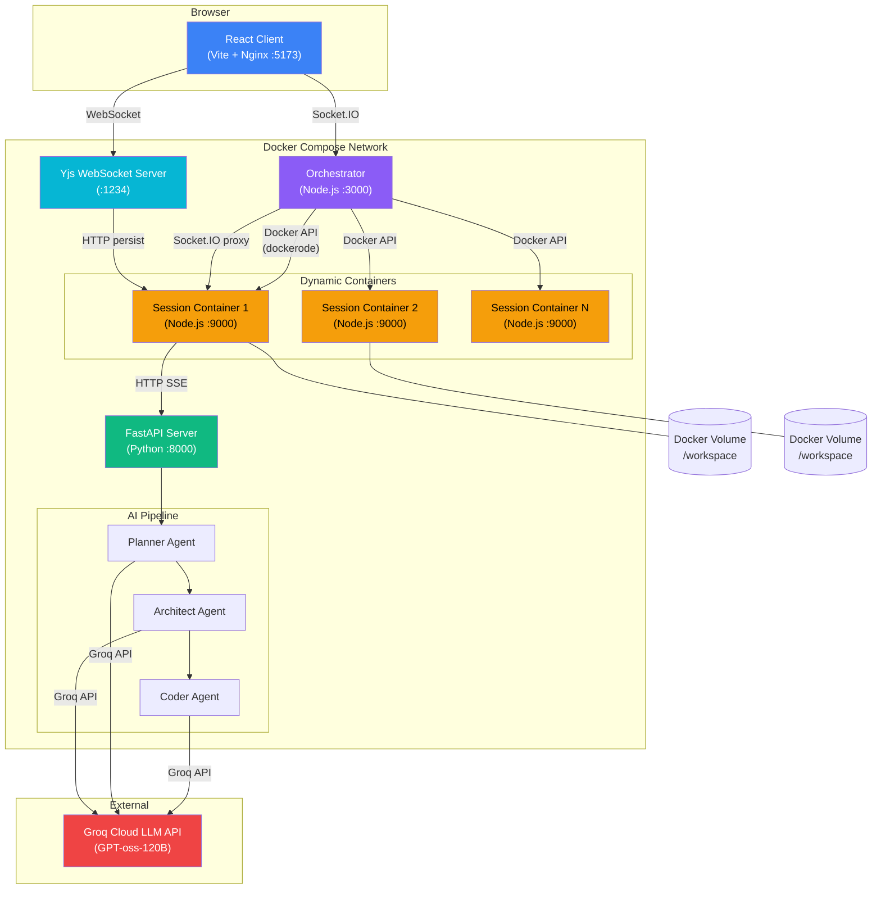
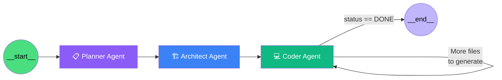
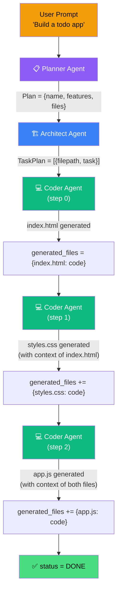
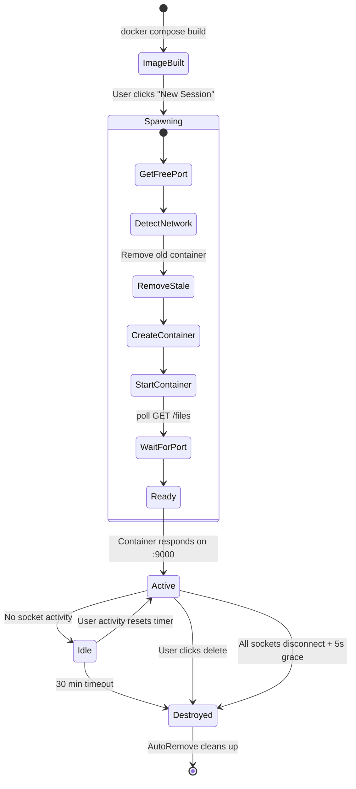
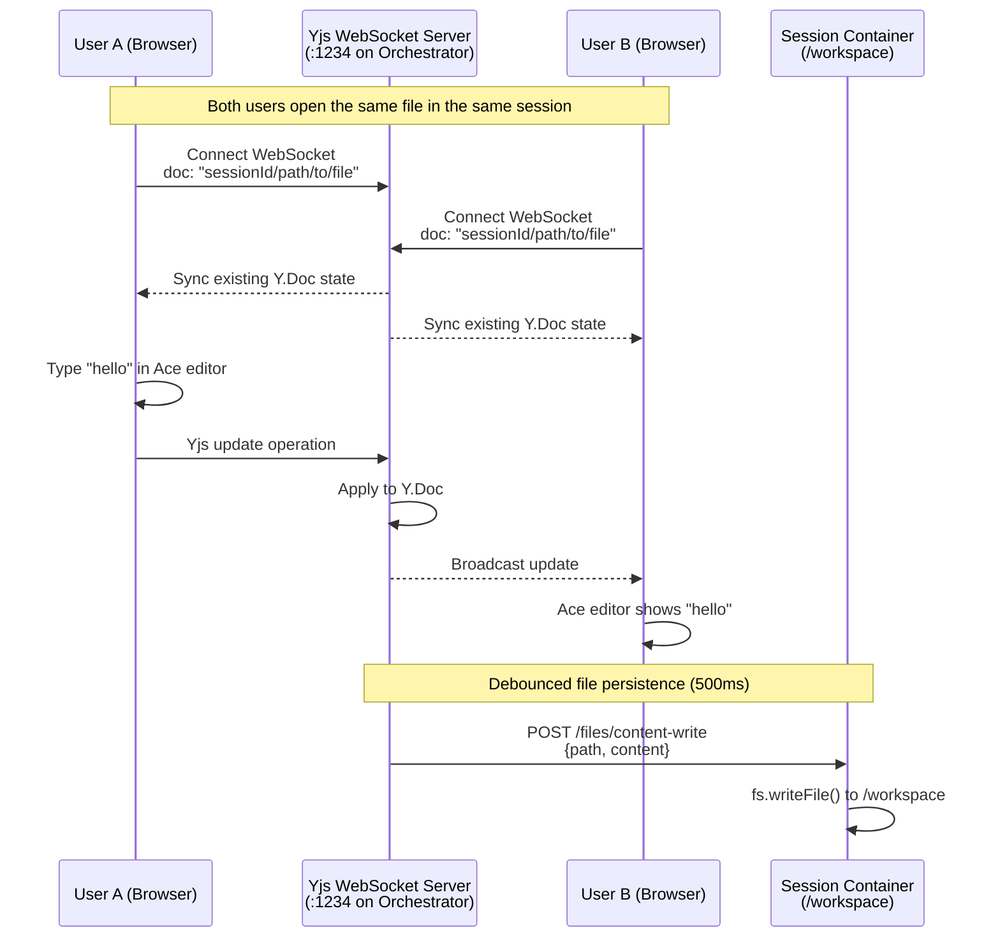
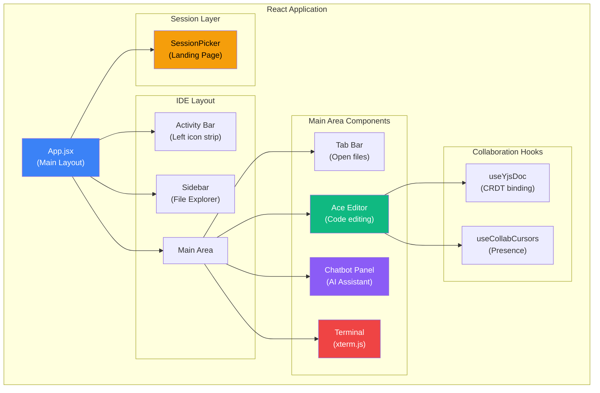
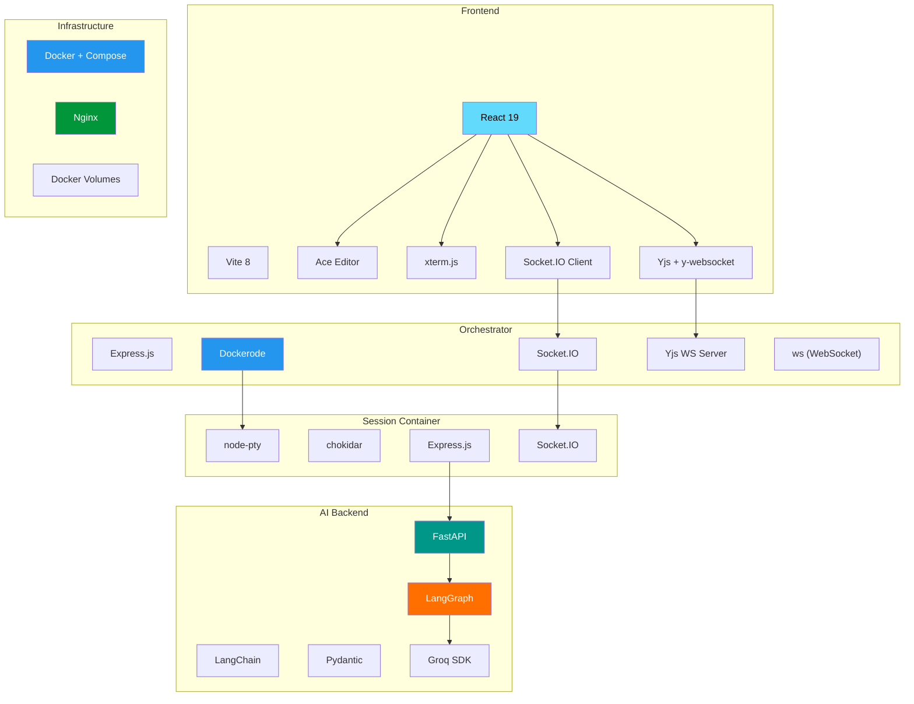

# 🛠️ Coder Buddy — Technical Deep Dive Presentation

> **AI-Powered Collaborative Cloud IDE** | Built with LangGraph, Docker, Yjs, React & Node.js

---

## 📋 Table of Contents

1. [Project Overview](#-1-project-overview)
2. [System Architecture](#-2-system-architecture)
3. [Multi-Agent AI Pipeline](#-3-multi-agent-ai-pipeline-langgraph)
4. [Docker Containerization & Orchestration](#-4-docker-containerization--orchestration)
5. [Real-Time Synchronization (Yjs CRDT)](#-5-real-time-synchronization-yjs-crdt)
6. [IDE Environment](#-6-ide-environment)
7. [End-to-End Sequence Diagram](#-7-end-to-end-sequence-diagram)
8. [Security Architecture](#-8-security-architecture)
9. [Technology Stack Summary](#-9-technology-stack-summary)

---

## 🎯 1. Project Overview

**Coder Buddy** is an AI-powered coding assistant and cloud IDE that transforms natural language prompts into complete, working web projects. It mimics a real multi-person development team:

| Capability | Description |
|---|---|
| 🤖 **AI Code Generation** | Describe what you want → get a fully working project |
| 🖥️ **Cloud IDE** | VS Code-like editor in the browser with file explorer, tabs, terminal |
| 🔄 **Real-time Collaboration** | Multiple users can edit simultaneously via CRDT sync |
| 🐳 **Sandboxed Execution** | Every session runs in its own Docker container |
| 💬 **Interactive Chat** | Conversational AI assistant with live progress streaming |

### How It Works (High Level)

```
User types: "Build a todo app"
   ↓
📋 Planner Agent    → Creates project plan (name, features, tech stack, files)
   ↓
🏗️ Architect Agent  → Breaks plan into per-file implementation tasks
   ↓
💻 Coder Agent      → Generates complete code for each file (loops)
   ↓
📁 Files written    → Appear in browser IDE file tree instantly
```

---

## 🏗️ 2. System Architecture

The system follows a **microservices architecture**, with 4 independent services communicating via HTTP, WebSocket, and Server-Sent Events (SSE).



### Service Breakdown

| Service | Port | Technology | Role |
|---|---|---|---|
| **React Client** | 5173 | Vite + React + Nginx | Browser-based IDE interface |
| **Orchestrator** | 3000, 1234 | Node.js + Express + Dockerode + Yjs | Session management, container lifecycle, CRDT server |
| **FastAPI Server** | 8000 | Python + FastAPI + LangGraph | AI agent pipeline + code execution API |
| **Session Container** | 9000 (dynamic) | Node.js + node-pty + chokidar | Per-user sandboxed workspace with terminal & filesystem |

### Communication Protocols

| Path | Protocol | Purpose |
|---|---|---|
| Client ↔ Orchestrator | **Socket.IO** | Session mgmt, terminal I/O, AI prompts, cursor presence |
| Client ↔ Yjs Server | **WebSocket** | CRDT document sync for collaborative editing |
| Orchestrator ↔ Session Container | **Socket.IO** (client) | Forwarding terminal, file, and AI events |
| Orchestrator ↔ Session Container | **HTTP** (proxy) | REST API proxy for file operations |
| Session Container ↔ FastAPI | **HTTP + SSE** | AI prompt dispatch + streaming response |
| FastAPI ↔ Groq Cloud | **HTTPS** | LLM inference calls |

---

## 🤖 3. Multi-Agent AI Pipeline (LangGraph)

The AI backbone is built on **LangGraph** — a framework for building stateful, multi-step agent graphs. The pipeline consists of 3 specialized agents connected in a directed graph.

### Agent Graph Structure



### 3.1 Planner Agent

**Purpose:** Converts a free-form user prompt into a structured project plan.

**Input:** `"Build a to-do list application"`

**Output:** Structured `Plan` object (JSON):

```json
{
  "name": "TodoApp",
  "description": "A web-based to-do list application",
  "techstack": "HTML, CSS, JavaScript (vanilla, no frameworks)",
  "features": ["Add tasks", "Delete tasks", "Mark complete", "Filter by status"],
  "files": [
    {"path": "index.html", "purpose": "Main HTML structure"},
    {"path": "styles.css", "purpose": "Stylesheet with modern design"},
    {"path": "app.js", "purpose": "Application logic and DOM manipulation"}
  ]
}
```

**Key Implementation Details:**
- Uses `llm.with_structured_output(Plan, method="json_mode")` to guarantee valid JSON
- Forces **vanilla tech stack** (no frameworks) — hardcoded override
- Cleans file paths to flat filenames (no directory prefixes)

**State model** ([states.py](file:///d:/coder-assist-main/coder-assist-main/agent/states.py)):
```python
class Plan(BaseModel):
    name: str
    description: str
    techstack: str
    features: list[str]
    files: list[File]    # File = {path, purpose}
```

---

### 3.2 Architect Agent

**Purpose:** Breaks the plan into ordered, per-file implementation tasks with detailed instructions.

**Input:** The `Plan` object from Planner

**Output:** Structured `TaskPlan` object:

```json
{
  "implementation_steps": [
    {
      "filepath": "index.html",
      "task_description": "Create the main HTML file with a task input field, an add button, a filter dropdown, and an unordered list for tasks. Link styles.css and app.js."
    },
    {
      "filepath": "styles.css",
      "task_description": "Style the application with a dark theme, gradient background, card-based layout, smooth hover transitions, and responsive design."
    },
    {
      "filepath": "app.js",
      "task_description": "Implement add, delete, toggle complete, and filter functionality using vanilla JavaScript DOM manipulation."
    }
  ]
}
```

**Rules enforced:**
- One task per file
- Ordering: HTML first → CSS → JavaScript
- Task descriptions must be detailed enough to implement standalone

---

### 3.3 Coder Agent (Loop)

**Purpose:** Generates the actual code for each file, one at a time, iterating through the task plan.

**Key Design Patterns:**

| Pattern | Description |
|---|---|
| **Self-looping** | Conditional edge: loops back to itself until all files are done |
| **Cross-file context** | Passes previously generated code as context so CSS matches HTML IDs |
| **Code extraction** | Uses regex `r'```\w*\s*\n([\s\S]*?)```'` to extract code from LLM output |
| **Strict rules** | No `import/export`, no framework code, browser-compatible JS only |

**State tracking** ([states.py](file:///d:/coder-assist-main/coder-assist-main/agent/states.py)):
```python
class CoderState(BaseModel):
    task_plan: TaskPlan
    current_step_idx: int = 0              # Which file we're on
    current_file_content: Optional[str]     # Current file being generated
    generated_files: dict[str, str] = {}    # filepath → code (accumulated)
```

**Loop termination logic** ([graph.py](file:///d:/coder-assist-main/coder-assist-main/agent/graph.py)):
```python
graph.add_conditional_edges(
    "coder",
    lambda s: "END" if s.get("status") == "DONE" else "coder",
    {"END": END, "coder": "coder"}
)
```

### Agent Pipeline Data Flow



### SSE Streaming Architecture

The AI pipeline results are streamed to the client in **real-time** via Server-Sent Events:

```
FastAPI (server.py)
  └─ event_stream() generator
       └─ compiled_graph.stream(inputs, config)    ← LangGraph
            ├─ yields planner output  → SSE: {agent: "planner", plan: {...}}
            ├─ yields architect output → SSE: {agent: "architect", task_plan: {...}}
            ├─ yields coder output #1  → SSE: {agent: "coder", generated_files: {...}}
            ├─ yields coder output #2  → SSE: {agent: "coder", generated_files: {...}}
            └─ yields completion       → SSE: {agent: "system", status: "complete"}
```

The SSE stream uses a **thread-safe queue** pattern:
1. LangGraph runs in a background thread (sync code)
2. Events are pushed to a `queue.Queue()`
3. An async generator polls the queue and yields SSE `data:` lines
4. FastAPI's `StreamingResponse` sends them to the client

---

## 🐳 4. Docker Containerization & Orchestration

### 4.1 Docker Compose Services

The entire application is defined in [docker-compose.yml](file:///d:/coder-assist-main/coder-assist-main/docker-compose.yml) with **4 services**:

```yaml
services:
  fastapi:       # AI pipeline — Python 3.11 + FastAPI + LangGraph
  client:        # React app — Vite build → Nginx
  orchestrator:  # Session manager — Node.js + dockerode
  editor-server: # Built but NOT auto-started (profile: build-only)
```

> [!IMPORTANT]
> The `editor-server` service uses `profiles: [build-only]` — Docker Compose builds the image but **never starts it** as a service. The **orchestrator spawns instances on demand** via the Docker API.

### 4.2 Container Lifecycle



### 4.3 How the Orchestrator Spawns Containers

The orchestrator ([orchestrator/index.js](file:///d:/coder-assist-main/coder-assist-main/orchestrator/index.js)) uses **Dockerode** to manage containers programmatically through the Docker socket:

```javascript
// Mount Docker socket for sibling container management
volumes:
  - /var/run/docker.sock:/var/run/docker.sock
```

**Spawning process** (simplified):

```javascript
async function spawnContainer(sessionId) {
    const port = await getFreePort();                    // 1. Find free host port
    const networkName = await getNetworkName();          // 2. Detect compose network
    
    // 3. Remove stale container (if crash left one behind)
    try { await docker.getContainer(containerName).remove({force: true}); } catch {}
    
    // 4. Create container with resource limits + security
    const container = await docker.createContainer({
        Image: 'coder-buddy-editor-server',
        HostConfig: {
            PortBindings: { '9000/tcp': [{ HostPort: String(port) }] },
            Binds: [`coder-session-${sessionId}:/workspace`],  // Named volume
            AutoRemove: true,                    // Self-cleanup
            Memory: 512 * 1024 * 1024,           // 512MB RAM max
            CpuQuota: 50000,                     // 50% CPU
            PidsLimit: 100,                      // Anti fork-bomb
            CapDrop: ['ALL'],                    // Drop all Linux capabilities
            SecurityOpt: ['no-new-privileges:true'],
        },
    });
    
    await container.start();                             // 5. Start
    await waitForPort(9000, containerHost);               // 6. Health check
    return { container, port, host: containerHost };
}
```

### 4.4 Session Container Internals

Each session container ([editor/server/index.js](file:///d:/coder-assist-main/coder-assist-main/editor/server/index.js)) runs:

| Component | Technology | Purpose |
|---|---|---|
| **Express.js** | HTTP | File CRUD API (`/files`, `/files/content`, `/files/create`, `/files/delete`) |
| **node-pty** | Pseudo-terminal | Real bash shell accessible from browser terminal |
| **chokidar** | Filesystem watcher | Detects file changes and emits `file:refresh` events |
| **Socket.IO** | WebSocket | Terminal I/O, file events, AI pipeline proxy |

**Dockerfile** ([editor/server/Dockerfile](file:///d:/coder-assist-main/coder-assist-main/editor/server/Dockerfile)):
```dockerfile
FROM node:20-slim

# Install python3 + build tools for node-pty native compilation
RUN apt-get update && apt-get install -y python3 make g++ bash

# Create sandboxed non-root user
RUN useradd -m -s /bin/bash sandboxuser && \
    mkdir -p /workspace && \
    chown sandboxuser:sandboxuser /workspace

USER sandboxuser    # Drop privileges!
```

### 4.5 Network Topology

All containers join the same Docker Compose network. The orchestrator discovers it dynamically:

```javascript
async function getNetworkName() {
    const networks = await docker.listNetworks();
    return networks.find(n => n.Name.endsWith('_default'))?.Name;
}
```

Internal communication uses container IPs on this shared network:
- `http://fastapi:8000` — AI pipeline
- `http://<container-ip>:9000` — Session containers

---

## 🔄 5. Real-Time Synchronization (Yjs CRDT)

### 5.1 What is CRDT?

**Conflict-free Replicated Data Type (CRDT)** enables multiple users to edit the same document simultaneously without conflicts — no operational transformation needed.

Coder Buddy uses **Yjs** — a high-performance CRDT implementation for collaborative editing.

### 5.2 Sync Architecture



### 5.3 Client-Side Binding

The [useYjsDoc](file:///d:/coder-assist-main/coder-assist-main/editor/client/src/hooks/useYjsDoc.js) hook manages the Yjs lifecycle:

```
1. Create Y.Doc for "sessionId/fileName"
2. Connect WebsocketProvider to ws://localhost:1234
3. On sync: seed document with file content (if empty)
4. Return { ytext, synced } to component
```

The **bidirectional Ace ↔ Yjs binding** in [App.jsx](file:///d:/coder-assist-main/coder-assist-main/editor/client/src/App.jsx):

```
Ace Editor → Yjs:
  aceSession.on('change', () => {
      ytext.delete(0, ytext.length)
      ytext.insert(0, aceVal)
  })

Yjs → Ace Editor:
  ytext.observe(() => {
      aceSession.setValue(yjsVal)
      editor.moveCursorToPosition(pos)   // preserve cursor
  })
```

> [!NOTE]
> An `isApplyingRemote` flag prevents infinite loops — when a remote change is being applied, local change listeners are disabled.

### 5.4 Cursor Presence

The [useCollabCursors](file:///d:/coder-assist-main/coder-assist-main/editor/client/src/hooks/useCollabCursors.js) hook provides live cursor awareness:

| Event | Direction | Data |
|---|---|---|
| `cursor:move` | Client → Orchestrator | `{file, row, col}` |
| `cursor:update` | Orchestrator → Other Clients | `{socketId, file, row, col}` |
| `cursor:leave` | Orchestrator → Other Clients | `{socketId}` |

Each remote cursor is rendered as:
- An **Ace marker** (colored vertical line at the cursor position)
- A **presence badge** (colored pill showing shortened socket ID)
- 8 distinct colors are assigned round-robin to different users

### 5.5 File Persistence Flow

Yjs document changes **don't directly write files**. Instead:

```
User keystroke → Yjs update op → Yjs Server
                                    ↓
                         scheduleFilePersist()  (debounced 500ms)
                                    ↓
                         POST /files/content-write to session container
                                    ↓
                         fs.writeFile() to /workspace volume
```

This means:
- ✅ Instant collaborative sync (CRDT merges in-memory)
- ✅ Debounced disk writes (prevents thrashing)
- ✅ No explicit "Save" button needed

---

## 🖥️ 6. IDE Environment

### 6.1 Component Architecture



### 6.2 Session Picker

Before entering the IDE, users see a **Session Picker** screen:

| Action | What Happens |
|---|---|
| **"+ New Session"** | Emits `session:new` → Orchestrator spawns a new container |
| **Click existing session** | Emits `session:select` → Orchestrator reconnects to existing container |
| **Delete session** | `DELETE /sessions/:id` → Orchestrator force-removes container |

Session IDs are stored in `sessionStorage` for tab persistence.

### 6.3 Code Editor (Ace Editor)

Built with **react-ace**, the editor provides:

| Feature | Implementation |
|---|---|
| **Syntax highlighting** | 14 language modes (JS, Python, HTML, CSS, Java, C/C++, etc.) |
| **Theme** | One Dark (port of Atom's theme) |
| **Autocomplete** | `enableBasicAutocompletion` + `enableLiveAutocompletion` |
| **Font** | JetBrains Mono → Cascadia Code → Fira Code (fallback chain) |
| **File icons** | Emoji-based: 🟨 JS, 🐍 Python, 🌐 HTML, 🎨 CSS, ☕ Java, etc. |
| **Tab management** | Multi-tab with close buttons, unsaved indicators |
| **Breadcrumb** | Path navigation bar above editor |

### 6.4 Integrated Terminal

Built with **xterm.js** + **node-pty**:

```
Browser                  Orchestrator         Session Container
┌─────────────┐         ┌──────────────┐     ┌──────────────────────┐
│ xterm.js    │ ──io──> │ forward      │ ──> │ ptyProcess.write()   │
│ (renders)   │ <──io── │ events       │ <── │ bash shell output    │
└─────────────┘         └──────────────┘     └──────────────────────┘
```

**Features:**
- Real bash shell running inside the Docker container
- 256-color support with GitHub-inspired dark theme
- Auto-resize via `ResizeObserver`
- **Command blocking:** `docker`, `kubectl`, `nsenter`, `chroot`, `mount` are blocked

### 6.5 AI Chatbot Panel

The [Chatbot](file:///d:/coder-assist-main/coder-assist-main/editor/client/src/components/Chatbot.jsx) component provides:

| Feature | Detail |
|---|---|
| **Agent-colored messages** | 📋 Planner (purple), 🏗️ Architect (blue), 💻 Coder (green), ⚙️ System (gray) |
| **Plan cards** | Rich rendering of project plan with features and file list |
| **Task step list** | Numbered implementation steps from architect |
| **Code blocks** | Syntax-highlighted code in coder responses |
| **File creation notifications** | `📁 File created: /project/index.html — check the file tree!` |
| **Typing indicator** | Animated dots during processing |
| **Streaming** | Messages update in real-time as agents work |

### 6.6 File Explorer

The [FileTree](file:///d:/coder-assist-main/coder-assist-main/editor/client/src/components/tree.jsx) component renders a recursive directory tree:

- **Sorted:** Folders first, then files alphabetically
- **Expandable:** Click directories to collapse/expand
- **Icons:** Emoji-based extension detection
- **Context menu:** Right-click → New File, New Folder, Delete
- **Inline input:** Rename-style text field for new items
- **Auto-refresh:** Updates on `file:refresh` events from chokidar

---

## 📊 7. End-to-End Sequence Diagram

This is the complete flow from opening the app to generating code:

```mermaid
sequenceDiagram
    actor User as User (Browser)
    participant Client as React Client<br/>(Nginx :5173)
    participant Orch as Orchestrator<br/>(Node.js :3000)
    participant Yjs as Yjs WS Server<br/>(:1234)
    participant SC as Session Container<br/>(Node.js :9000)
    participant FS as /workspace<br/>(Docker Volume)
    participant FA as FastAPI<br/>(:8000)
    participant LG as LangGraph<br/>(AI Pipeline)

    rect rgb(30, 40, 60)
        Note over User,SC: 1 — Session Creation
        User->>Client: Open http://localhost:5173
        Client->>Orch: socket.io connect
        User->>Client: Click "New Session"
        Client->>Orch: emit session:new
        Orch->>Orch: getFreePort()
        Orch->>Orch: getNetworkName()
        Orch->>SC: docker.createContainer() + start()
        SC-->>Orch: container started
        Orch->>SC: waitForPort (GET /files)
        SC-->>Orch: 200 OK
        Orch-->>Client: emit session:status {ready, sessionId}
        Client->>Orch: GET /files (x-session-id header)
        Orch->>SC: proxy GET /files
        SC->>FS: readdir /workspace
        FS-->>SC: file tree
        SC-->>Client: {tree: {}}
    end

    rect rgb(30, 60, 40)
        Note over User,Yjs: 2 — File Editing with CRDT Sync
        User->>Client: Click file in explorer
        Client->>Orch: GET /files/content?path=...
        Orch->>SC: proxy GET /files/content
        SC->>FS: readFile()
        FS-->>Client: {content: "..."}
        Client->>Yjs: WebSocket connect (sessionId/filePath)
        Yjs-->>Client: sync Y.Doc state
        Client->>Client: bind Ace editor ↔ Y.Doc
        User->>Client: Type in editor
        Client->>Yjs: Yjs update op
        Yjs->>SC: scheduleFilePersist (500ms debounce)
        SC->>FS: writeFile()
    end

    rect rgb(60, 30, 60)
        Note over User,Orch: 3 — Cursor Presence
        User->>Client: Move cursor
        Client->>Orch: emit cursor:move {file, row, col}
        Orch-->>Client: emit cursor:update to peers
    end

    rect rgb(60, 40, 20)
        Note over User,FS: 4 — Terminal Usage
        User->>Client: Type command
        Client->>Orch: emit terminal:write
        Orch->>SC: forward terminal:write
        SC->>SC: ptyProcess.write()
        SC-->>Client: emit terminal:data (output)
        SC->>FS: filesystem change
        FS-->>SC: chokidar detect
        SC-->>Client: emit file:refresh
    end

    rect rgb(20, 50, 60)
        Note over User,FS: 5 — AI Code Generation
        User->>Client: Type prompt in chat
        Client->>Orch: emit ai:prompt
        Orch->>SC: forward ai:prompt
        SC->>FS: mkdir /workspace/project-name/
        SC-->>Client: emit ai:project-created
        SC->>FA: POST /api/generate {prompt}
        FA->>LG: compiled_graph.stream()

        LG->>LG: planner_agent()
        LG-->>FA: SSE {agent:planner}
        FA-->>SC: SSE stream
        SC-->>Client: emit ai:response

        LG->>LG: architect_agent()
        LG-->>FA: SSE {agent:architect}
        FA-->>SC: SSE stream
        SC-->>Client: emit ai:response

        loop For each file
            LG->>LG: coder_agent()
            LG-->>FA: SSE {agent:coder, generated_files}
            FA-->>SC: SSE stream
            SC->>FS: writeFile() to /workspace
            SC-->>Client: emit ai:file-created
        end

        LG-->>FA: SSE {status:complete}
        SC-->>Client: emit ai:response (complete)
    end
```



---

## 🔒 8. Security Architecture

### Container Hardening

| Security Measure | Implementation |
|---|---|
| **Non-root user** | `USER sandboxuser` in Dockerfile |
| **Capability drop** | `CapDrop: ['ALL']` — removes all Linux capabilities |
| **Minimal cap add** | Only `CHOWN`, `SETUID`, `SETGID` for node-pty |
| **No privilege escalation** | `SecurityOpt: ['no-new-privileges:true']` |
| **Resource limits** | 512MB RAM, 50% CPU, 100 process limit |
| **Auto-remove** | `AutoRemove: true` — container self-destructs on stop |
| **Idle timeout** | 30 minutes of inactivity → auto-destroy |

### Command Blocking

The session container blocks dangerous terminal commands:

```javascript
const blocked = ['docker', 'kubectl', 'nsenter', 'chroot',
                 '/proc/sysrq', 'mount', 'umount'];
```

### Path Sanitization

All file API endpoints sanitize paths to prevent directory traversal:

```javascript
const safePath = path.normalize(filePath).replace(/^(\.\.(\\/|\\\\|$))+/, '');
const fullPath = path.join(userDir, safePath);
```

### Network Isolation

- Session containers are on the Docker Compose internal network
- Only the orchestrator can reach them (via container IP)
- External access is only through mapped ports on the host

---

## ⚙️ 9. Technology Stack Summary



### Full Dependency Table

| Layer | Package | Version | Purpose |
|---|---|---|---|
| **Frontend** | React | 19.2 | UI framework |
| | Vite | 8.0 | Build tool & dev server |
| | react-ace | 14.0 | Code editor component |
| | @xterm/xterm | 6.0 | Terminal emulator |
| | socket.io-client | 4.8 | Real-time communication |
| | yjs | 13.6 | CRDT implementation |
| | y-websocket | 2.0 | Yjs WebSocket transport |
| **Orchestrator** | express | 4.18 | HTTP framework |
| | dockerode | 4.0 | Docker Engine API client |
| | socket.io | 4.8 | WebSocket framework |
| | ws | 8.20 | Raw WebSocket server (Yjs) |
| | yjs / y-websocket | — | CRDT document server |
| **AI Backend** | FastAPI | 0.115 | Python web framework |
| | LangGraph | 0.6 | Agent graph framework |
| | LangChain | 0.3 | LLM abstraction layer |
| | langchain-groq | 0.3 | Groq LLM provider |
| | Pydantic | 2.11 | Data validation / schemas |
| **Session Container** | node-pty | 1.1 | Pseudo-terminal for bash |
| | chokidar | 5.0 | Filesystem watcher |
| | express | 5.2 | HTTP file API |
| **Infrastructure** | Docker Compose | — | Multi-container orchestration |
| | Nginx (alpine) | — | Static file server for built React |
| | Python 3.11 | — | AI pipeline runtime |
| | Node.js 20 | — | JavaScript runtime (3 services) |

---

## 📌 Key Design Decisions

| Decision | Rationale |
|---|---|
| **Vanilla JS output only** | AI-generated code must run directly in a browser — no build step needed |
| **One container per session** | Full environment isolation; crashed sessions don't affect others |
| **Yjs CRDT over OT** | More resilient to network issues, no central transformation server |
| **SSE for AI streaming** | Simpler than WebSocket for unidirectional server-to-client streaming |
| **Dockerode over CLI** | Programmatic control, error handling, and container inspection |
| **Debounced persistence** | 500ms debounce prevents excessive disk writes during rapid typing |
| **Cross-file context** | Coder agent receives all previously generated code to ensure consistency |

---

> **Coder Buddy** — *Describe it. Build it. Ship it.* ⚡
